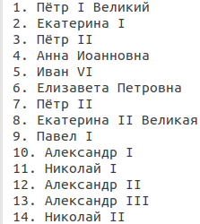
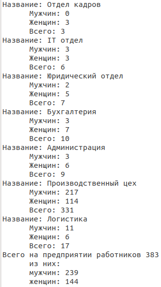
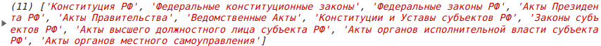

## Задача 1. Работа с массивом
Необходимо вывести в консоль нумерованный список исходных данных при помощи цикла (любого, что знаете/умеете).

```js
// Начальные данные, здесь ничего нельзя менять
let emperors = [
  'Пётр I Великий',
  'Екатерина I',
  'Пётр II',
  'Анна Иоанновна',
  'Иван VI',
  'Елизавета Петровна',
  'Пётр II',
  'Екатерина II Великая',
  'Павел I',
  'Александр I',
  'Николай I',
  'Александр II',
  'Александр III',
  'Николай II'
];

// Пишите свой код ниже
```

Результат должен быть в точности таким (обратите внимание на одиночный пробел слева списка):  


=========================

## Задача 2. Работа с объектом
Необходимо вывести в консоль название отдела, кол-во работников каждого пола и общее кол-во работников отдела. В конце списка вывести общее кол-во работников предприятия с разбивкой по полу.
Результат должен быть в точности таким (обратите внимание на пробелы слева некоторых строк списка):  



```js
// Начальные данные, здесь ничего нельзя менять
let staff = [
  {
    title: 'Отдел кадров',
    male: 0,
    female: 3,
  }, {
    title: 'IT отдел',
    male: 3,
    female: 3,
  }, {
    title: 'Юридический отдел',
    male: 2,
    female: 5,
  }, {
    title: 'Бухгалтерия',
    male: 3,
    female: 7,
  }, {
    title: 'Администрация',
    male: 3,
    female: 6,
  }, {
    title: 'Производственный цех',
    male: 217,
    female: 114,
  },{
    title: 'Логистика',
    male: 11,
    female: 6,
  },
];

let male = 0; // количество мужчин
let female = 0; // количество женщин
let total = 0; // общее количество работников

// Пишите свой код ниже
```

=========================

## Задача 3. Работа с массивом
Необходимо:
- заменить элемент 'Федеральные законы' на два элемента - 'Конституция РФ' и 'Федеральные конституционные законы';
- удалить элемент - 'купить молоко'.
- получившийся массив просто вывести в консоль, никакое форматирование можно не использовать.

```js
// Начальные данные, здесь ничего нельзя менять
let docs = [
  'Федеральные законы',
  'Федеральные законы РФ',
  'Акты Президента РФ',
  'Акты Правительства',
  'Ведомственные Акты',
  'купить молоко',
  'Конституции и Уставы субъектов РФ',
  'Законы субъектов РФ',
  'Акты высшего должностного лица субъекта РФ',
  'Акты органов исполнительной власти субъекта РФ'
];

// Пишите свой код ниже


// Результат выводим в консоль
console.log(docs);
```
Результат из консоли браузера Google Chrome:  


=========================

## Задача 4. The best of the best calculator!
Необходимо:
- исправить все ошибки, как в коде, так и в комментариях, чтобы выглядело "грамотно". Не забудьте расскоментировать блок кода в конце примера.

```js
//Уважаемые, бухгалтера, так как JavaScript является языком програмирования и умеет работать, исключительно, с цифрами, Я сделал Вам замену старому калькулятору в бухгалтерии. 


//Теперь, для того чтобы сложить два числа достаточно поменять цифры в строке 3 и 4!

let firstSumNumber = 7;
led secondSumNumber = 3; 

let sumResult = firstSumNumber + secondSumNumber;

console.log('Сумма', firstSumNumber, 'и', secondSumNumber, 'равно', sumResult);


//Для того что бы сделать отминусовывание нужно изменить цифры в строке 14 и 16

let firstSubNumber = 7;
let secondSubNumber = 3; 

let subResult = firstSubNumber - secondSubNumber;

consolelog(firstSubNumber, 'минус', secondSubNumber, 'будет', subResult); 


//Для того что бы умножеть числа нужно изменить цифры в строке 23 и 24

let firstMultNumber = 7;
let secondMultNumber = 3; 

let multResult = firstMultNumber * secondmultNumber;

consolelog('Умнажаем', firstMultNumber, 'на', secondMultNumber, 'Результат -', multResult); 


//Для того что бы разделить число на число цифры в строке 23 и 24 меняем мы

let firstDivtNumber  7; 
let secondDivNumber = 3; 

let divResult = firstMultNumber / secondMultNumber; 

console.log('При делении', firstMultNumber, 'на' secondMultNumber, 'получим', divResult); 


//Я пока еще не разобрался с начислением процентов, но ВЫ и сами знаете как это делается, так что можете сами его доделать... а проверить сможете начислив к моей зарплате 15% премемии ;)

/*
let myZarplata = 70000; 
let percent = 15; 

let itogo = myZarplata * percent; 

console.log(itogo); */
```

=========================

## Задача 5. Новостная статья
Необходимо: сверстать статью, расставив все необходимые переменные в правильном порядке - заголовок, дата, картинка, абзацы статьи. 

```js
//Секция переменных, здесь ничего нельзя менять

let artOpen = '<article>';
let artClose = '</article>';

let h3Open = '<h3>';
let h3Close = '</h3>';

let paragraphOpen = '<p>';
let paragraphClose = '</p>';

let data = '15 ноября 2018';

let img = '';

let title = 'Новая линия производства';

let contentFirstLine = '"Новая линия производства запущена на заводе нигерийской компании «Аметист», который ведет производство металлокорда и стальной фибры на территории особой экономической зоны (ОЭЗ). Об этом сообщил в среду глава региона Иван Смирнов по итогам деловой встречи с послом Нигерии в Мбао Геннере.';

let contentSecondLine = '"Сегодня мы запускаем новую линию на производстве. Это говорит о высокой степени доверия представителей бельгийского бизнеса к России. Регион дорожит этим доверием, стараясь создавать максимально благоприятный деловой климат, что подтверждает масштабное расширение завода «Аметист»", — сказал директор Петров.';

let contentThirdLine = 'В свою очередь Геннере высказал заинтересованность в развитии деловых контактов с регионом, отметив, что Россия является важным бизнес-партнером для Нигерии. «Мы рассчитываем на продолжение этой работы, так как в особой экономической зоне созданы максимально комфортные условия для ведения бизнеса», — добавил он.';


//Пишите свой код ниже
```

=========================

_Продолжение следует..._
